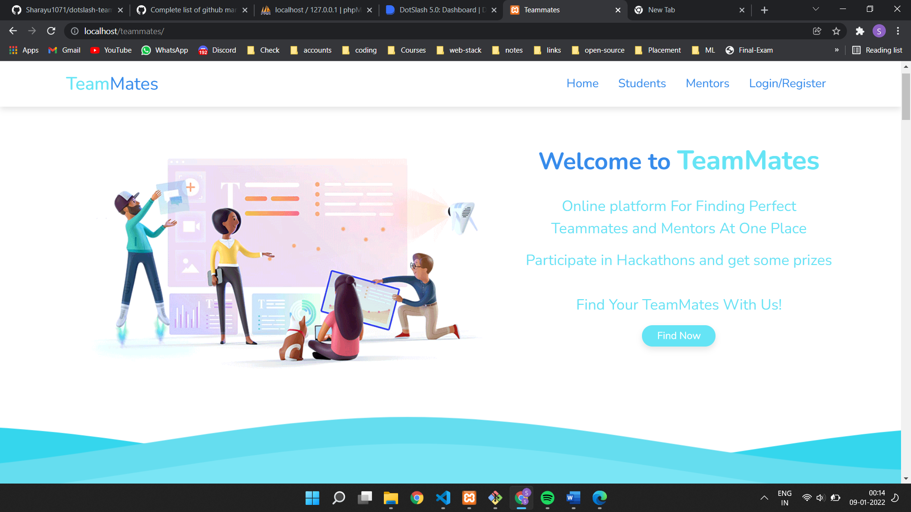
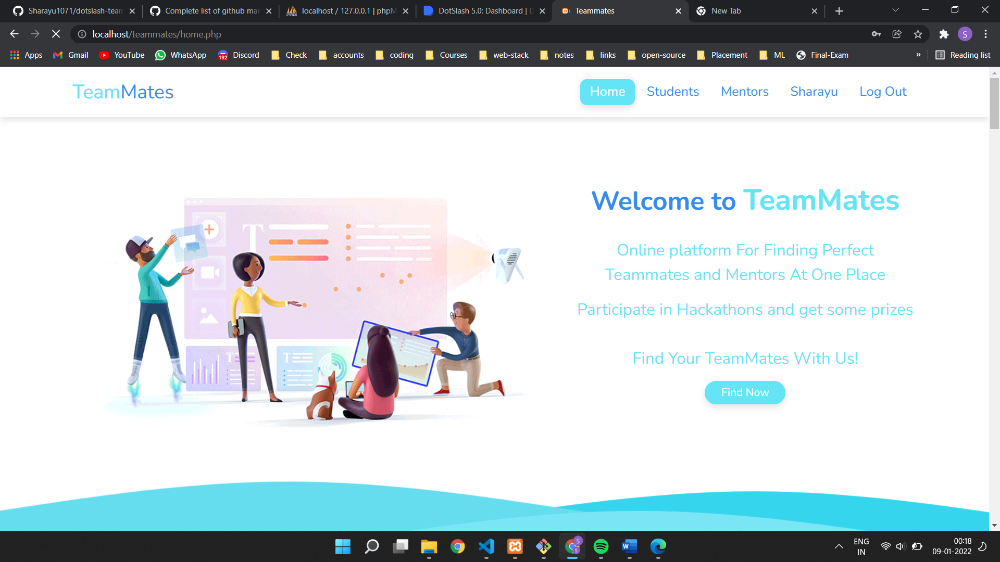
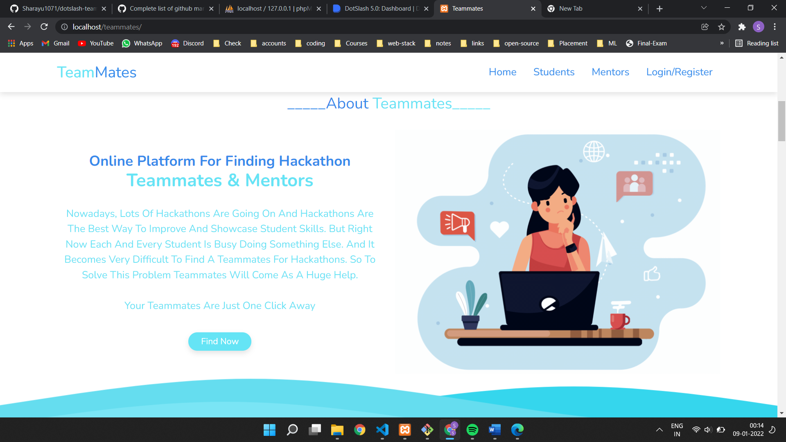
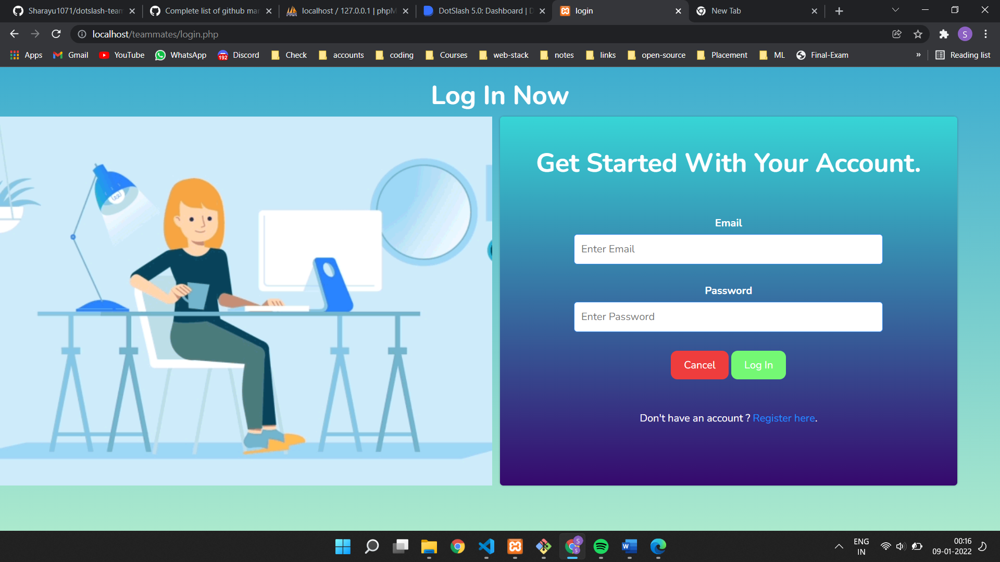
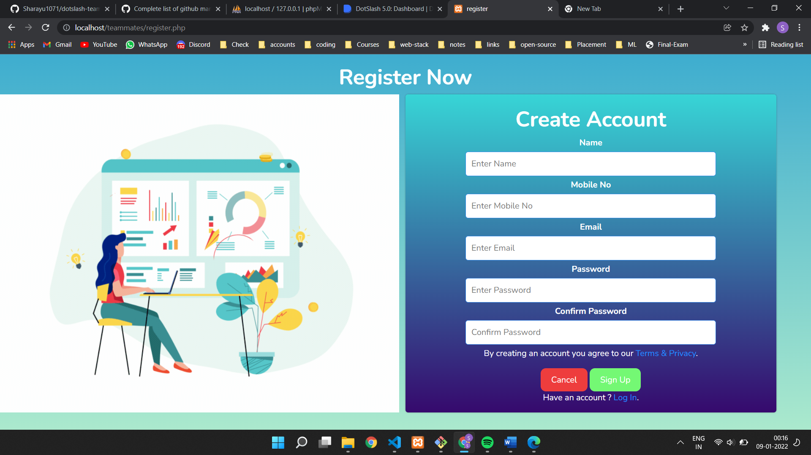
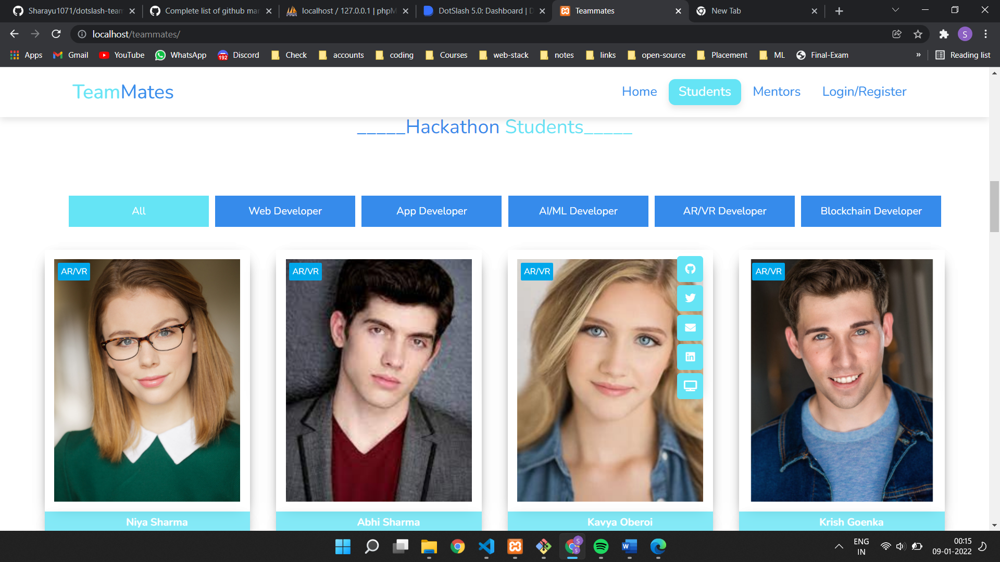
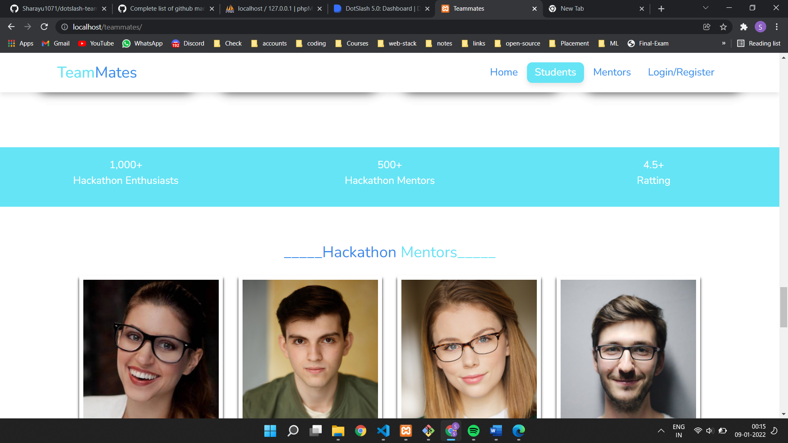
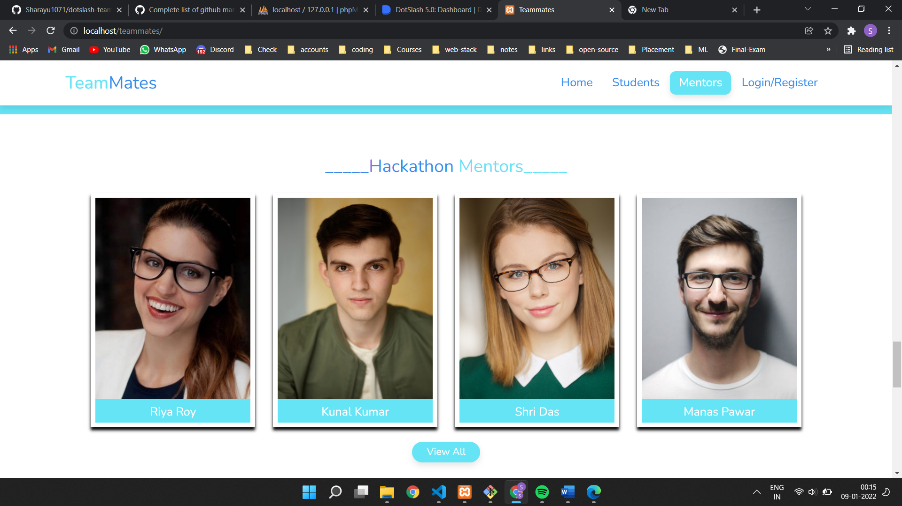
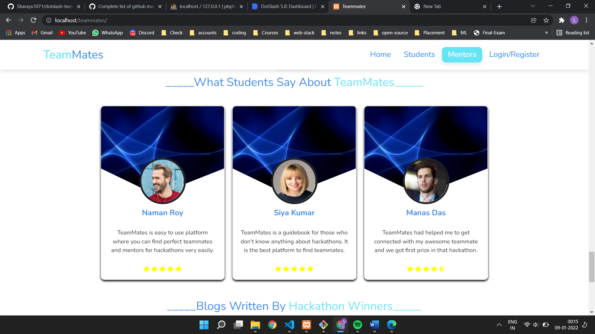
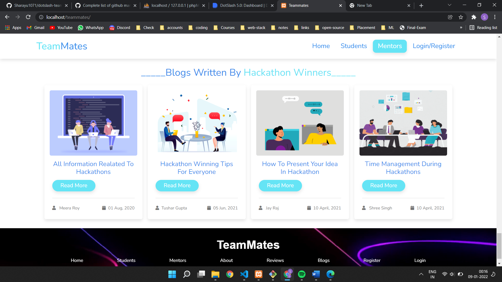

## :dizzy: Track: Open Innovation

## :sparkles: Team Name: 404_Found

## :two_women_holding_hands: Project Name: TeamMates

# :question: Problem Statement
Nowadays, lots of hackathons are going on and hackathons are the best way to improve and showcase student skills. But right now each and every student is busy doing something else like CP, DSA, Development, Open Source, etc. And it becomes very difficult for a student to find teammates for hackathons. 

## Solution: TeamMates

# :star2: Introduction
TeamMates is a simple and easy to use web application where you can find teammates and mentors as well. Here you can select teammates and mentors according to your domain. You can check out their portfolio, Github, and all social links to know more about them. If you want to team up with them then you can contact them and make a team for the hackathon.

# :memo: Modules

- Register
- Login 
- Select Student according to domain
- Select Mentor according to domain
- Review Section
- Blogs Section
- Application stats

# :telescope: Tech Stack

### The project is created using

- HTML
- CSS
- Javascript
- bootstrap
- PHP
- MySQL
- Git

# 🚀 Future Plans

- Two Login Option
    - Login as Student
    - Login as Mentor 
- Right swipe and left swipe option while selecting teammate or mentor.
- Discussion forum for students

## Landing Page

## Main Page After Login

## About section

## Login Page

## Registration page

## Students Section

## Stats section

## Mentors Section

## Review Section 

## Blog Section

# Thank You

